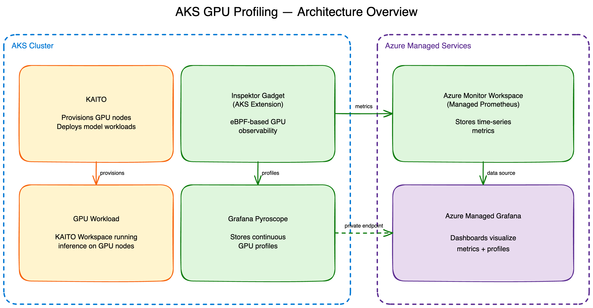

# GPU Profiling Quickstart with Terraform

This project is my Terraform implementation of [GPU profiling for AKS](https://learn.microsoft.com/en-us/azure/aks/gpu-profiling). It stands up an end-to-end environment for **profiling GPU workloads** on AKS: [KAITO](https://github.com/kaito-project/kaito) provisions GPU nodes and deploys a model inference workload, then GPU profiling shows what that workload is actually doing to the GPU (utilization, memory, kernel activity) so you can reason about efficiency and bottlenecks.

The profiling signal comes from [Inspektor Gadget](https://www.inspektor-gadget.io/)'s eBPF-based GPU observability, exported two ways:

- **Metrics** (GPU utilization, memory, temperature) scraped into **Azure Monitor managed Prometheus** and visualized in **Azure Managed Grafana**.
- **Continuous profiles** collected by **Grafana Pyroscope** running in-cluster, surfaced in Grafana as a Pyroscope data source (reached over a managed private endpoint) so you can drill into GPU memory usage over time.

The scenario is a right-sizing story. We deploy a small language model (`ibm-granite/granite-4.1-3b`) as a demo inference service, use profiling to discover its *true* GPU footprint, and then match the hardware to what the workload actually needs instead of guessing. It's a deliberately compact, low-traffic example so the signal is easy to read, but the workflow is the same one you'd run against any GPU workload, at any scale.

## Architecture



## What Terraform creates

Core platform:

- **Resource group** (`rg-gpuprofiling<NN>`) holding everything.
- **AKS cluster** ([aks.tf](./aks.tf)) with a system-assigned identity, OIDC issuer and workload identity enabled, and Azure Monitor metrics (managed Prometheus) plus Container Insights turned on.
- **KAITO** ([kaito.tf](./kaito.tf)) installed via Helm: the `gpu-provisioner` (with a user-assigned identity and federated credential for node provisioning) and the `workspace` controller that deploys model inference workloads onto GPU nodes.

Observability and profiling:

- **Inspektor Gadget** ([inspektor-gadget.tf](./inspektor-gadget.tf)) installed as an AKS extension with `gpuObservability.enabled` and `azureMonitor.enabled`.
- **Grafana Pyroscope** ([pyroscope.tf](./pyroscope.tf)) installed via Helm into the `gadget` namespace, exposed on an internal load balancer fronted by an Azure Private Link Service (PLS) so Managed Grafana can reach it privately.
- **Azure Managed Grafana** ([grafana.tf](./grafana.tf)) (v12) integrated with the Azure Monitor workspace, with a managed private endpoint to the Pyroscope PLS.
- **Azure Monitor workspace** ([prometheus.tf](./prometheus.tf)) (managed Prometheus) with data collection endpoints/rules and recording/alert rule groups, plus a **Log Analytics workspace** ([logs.tf](./logs.tf)).

## Prerequisites

Install the following tools:

- [Terraform](https://developer.hashicorp.com/terraform/install)
- [Azure CLI](https://learn.microsoft.com/cli/azure/install-azure-cli)
- [kubectl](https://kubernetes.io/docs/tasks/tools/) (to apply KAITO workspaces and inspect the cluster)
- [jq](https://jqlang.github.io/jq/) (used to read Terraform outputs)

Then authenticate the Azure CLI to a subscription with permissions to create Azure resources and assign roles. Review the variables in [variables.tf](./variables.tf) before deploying (for example `location`, default `brazilsouth`, and the KAITO versions).

> [!IMPORTANT]
> KAITO provisions dedicated GPU nodes on demand, so your subscription needs enough GPU **vCPU quota** in the target region for the VM family you deploy. The workloads below use the `Standard_NC24ads_A100_v4` (NCADS A100 v4 family) and `Standard_NC4as_T4_v3` (NCASv3 T4 family) sizes. Check your current quota for the region you set in [variables.tf](./variables.tf) (default `brazilsouth`) and request an increase if needed before deploying, otherwise KAITO node provisioning will fail with a quota error.
>
> ```bash
> az vm list-usage --location brazilsouth --query "[?contains(name.value, 'NC')].{Family:localName, Used:currentValue, Limit:limit}" -o table
> ```
>
> If quota is insufficient, request an increase from **Quotas** in the Azure portal or via `az quota`. See [Increase VM-family vCPU quotas](https://learn.microsoft.com/azure/quotas/per-vm-quota-requests).

## Deploy

Run the Terraform apply command and enter `yes` when prompted to deploy the Azure resources.

```bash
terraform apply
```

Terraform outputs to environment variables for use in the next steps.

```bash
read -r RG_NAME AKS_NAME GRAFANA_NAME PROMETHEUS_NAME PROMETHEUS_ENDPOINT PYROSCOPE_URL <<< "$(terraform output -json | jq -r '[.rg_name.value,.aks_name.value,.grafana_name.value,.prometheus_name.value,.prometheus_endpoint.value,.pyroscope_url.value] | @tsv')"
```

## Configure Grafana data sources and dashboard

The managed Prometheus data source is provisioned automatically by Azure Managed Grafana through the Azure Monitor workspace integration, so you only need to add the Pyroscope data source. Grafana reaches Pyroscope over the managed private endpoint, so `PYROSCOPE_URL` is the private IP on port 4040.

```bash
az grafana data-source create -n "$GRAFANA_NAME" -g "$RG_NAME" --definition "{
  \"name\": \"local-pyroscope\",
  \"uid\": \"local-pyroscope\",
  \"type\": \"grafana-pyroscope-datasource\",
  \"access\": \"proxy\",
  \"url\": \"${PYROSCOPE_URL}\",
  \"jsonData\": { \"keepCookies\": [\"pyroscope_git_session\"] }
}" --debug

az grafana data-source show -n "$GRAFANA_NAME" --data-source local-pyroscope
```

Import the Inspektor Gadget Advanced GPU Observability dashboard.

```bash
az grafana dashboard create \
  -n "$GRAFANA_NAME" \
  -g "$RG_NAME" \
  --definition "$(curl -sSL https://gist.githubusercontent.com/mqasimsarfraz/fca8e2394beb7454f467cf82785e2ee3/raw/2eb00a3853362bc863c292283041e8e283fe46ed/AdvancedGPUObservability.json)"
```

Open the dashboard.

```bash
GRAFANA_URL=$(az grafana show -n "$GRAFANA_NAME" -g "$RG_NAME" --query properties.endpoint -o tsv)
echo "${GRAFANA_URL}/d/AdvancedGPUObservability"
```

## Deploy a GPU workload with KAITO

Log into the AKS cluster.

```bash
az aks get-credentials -g "$RG_NAME" -n "$AKS_NAME"
```

Deploy a KAITO Workspace. This provisions a GPU node (A100) and runs inference for the `ibm-granite/granite-4.1-3b` model.

```bash
kubectl apply -f - <<EOF
apiVersion: kaito.sh/v1beta1
kind: Workspace
metadata:
  name: workspace-granite-4-1-3b
inference:
  preset:
    accessMode: public
    name: ibm-granite/granite-4.1-3b
resource:
  count: 1
  instanceType: Standard_NC24ads_A100_v4
  labelSelector:
    matchLabels:
      app: workspace-granite-4-1-3b
EOF
```

### Right-sizing the GPU: why switch from A100 to T4

This is where the GPU profiling pays off. The `Standard_NC24ads_A100_v4` ships an **80 GB** A100, and the GPU metrics dashboard makes it look like that memory is almost completely consumed. That is misleading: **vLLM will take as much GPU memory as you give it**, pre-reserving most of the device for its KV cache regardless of how big the model actually is.

The **memory profile from Pyroscope tells a completely different story**. Profiling the running workload shows the vLLM process only actually uses about **6 GB out of 80 GB** to serve `ibm-granite/granite-4.1-3b`; the rest is reserved headroom, not real demand. In other words, the A100 was the wrong SKU: ~60 GB of expensive GPU memory sitting idle.

Because the true footprint is so small, we can size *down* to a `Standard_NC4as_T4_v3`. The T4's **16 GB** still comfortably fits the ~6 GB model with sufficient headroom for the runtime, giving you *just enough* GPU for the workload, and on the order of a **10x-plus reduction in on-demand compute cost** versus the A100 (exact pricing varies by region and any reservation or Spot discounts). The model weights stay the same size and the model remains performant; you have simply stopped paying for an over-provisioned GPU. The profiling signal (managed Prometheus for the "what" + Pyroscope for the "why") is what makes this decision data-driven rather than a guess.

The one trade-off: the T4 has CUDA compute capability 7.5, so it cannot use FlashAttention 2 (FA2 requires compute capability >= 8). We fall back to the `TRITON_ATTN` attention backend via a `ConfigMap`, then deploy the same workload onto the T4.

```bash
kubectl apply -f - <<EOF
apiVersion: v1
kind: ConfigMap
metadata:
  name: workspace-granite-4-1-3b-config
data:
  inference_config.yaml: |
    vllm:
      attention-backend: TRITON_ATTN
---
apiVersion: kaito.sh/v1beta1
kind: Workspace
metadata:
  name: workspace-granite-4-1-3b
inference:
  config: workspace-granite-4-1-3b-config
  preset:
    accessMode: public
    name: ibm-granite/granite-4.1-3b
resource:
  count: 1
  instanceType: Standard_NC4as_T4_v3
  labelSelector:
    matchLabels:
      app: workspace-granite-4-1-3b
EOF
```

Once the workload is running on the GPU node, watch the signals in Grafana: the **Advanced GPU Observability** dashboard (managed Prometheus) shows GPU utilization, memory, and temperature per GPU, and the **Pyroscope** data source shows continuous GPU memory profiles you can correlate with the inference workload.

### Performance considerations

For this workload profile, the T4 is genuinely the right tool, and profiling is what let us prove it rather than guess. To apply the same result to your own app, it helps to understand what that reserved GPU memory was doing. Most of the A100's memory that looked "consumed" was vLLM's **KV cache**. The KV cache does **not** make a single request faster; it stores the attention keys/values for tokens currently in flight, so what it really buys you is **capacity**: longer context lengths and more concurrent requests batched together. vLLM sizes it to whatever memory is available (`--gpu-memory-utilization`, default ~0.9), which is why it looked like the whole A100 was in use.

So for a low-concurrency, modest-context service like this one, dropping from ~60 GB to ~10 GB of KV cache costs you nothing you were actually using (no per-request latency, no model quality); it only lowers the **ceiling** on concurrency and context, which this workload never approached. The trade-off that *does* affect speed is the hardware itself: the T4 has far lower memory bandwidth than the A100 (and we dropped FlashAttention 2 for `TRITON_ATTN`), and LLM decoding is memory-bandwidth bound, so per-token throughput on the T4 is lower. That is why the demo explicitly checks that the model is *still performant* after the switch, and for this scale, it is.

The practical takeaway: the savings are real, and the *right* GPU is determined by your **expected concurrency and context length**, not by the model size alone. Steady low-to-moderate traffic on a small model rarely needs an A100's KV headroom, so right-sizing is a clear win here. High-concurrency or long-context workloads legitimately do need that headroom, and there a larger GPU (or tuning `--max-model-len` and `--max-num-seqs`) is the correct call. Treat this as a **demonstration of the method** (using profiling to match a GPU to a workload), and run the same profiling exercise against your real traffic to land on the SKU that fits it.

## Key takeaway

Profiling turned a guess into a measurement: managed Prometheus showed the A100's memory looked nearly full, but Pyroscope revealed the workload's *true* footprint was only ~6 GB; roughly **60 GB of the 80 GB A100 sat idle**. That evidence justified dropping to a 16 GB T4, cutting on-demand GPU cost by **~10x** with no loss in model quality and no user-facing latency change for this low-concurrency, modest-context service. The method, not the specific SKU, is the point: profile your real traffic, then match the GPU to what the workload actually needs.

## Cleanup

```bash
terraform destroy
```
